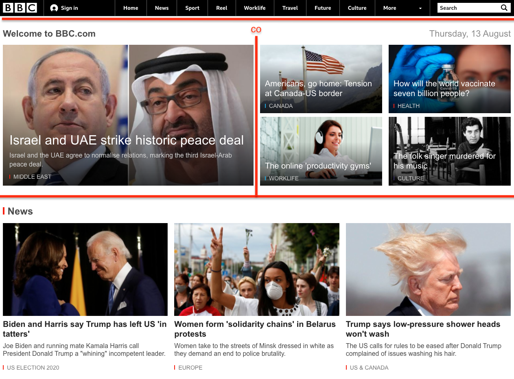

# Page-Layouts

A collection of website layouts made in HTML and CSS for #100devs with :blue_heart:

## Included Layouts
- [BBC News](#bbc-news-original)
- [Khan Academy](#khan-academy-original)
- [Level Ground](#level-ground-original)
- [Source](#source-original)
- [TechCrunch](#techcrunch-original)

## Preview

### BBC News ([original](https://www.bbc.com/))

### Khan Academy ([original](https://www.khanacademy.org/))

### Level Ground ([original](level-ground/level-ground-wireframe.png))

### Source ([original](https://dribbble.com/shots/8718928-Source-Wireframes))

### TechCrunch ([original](https://techcrunch.com/))

